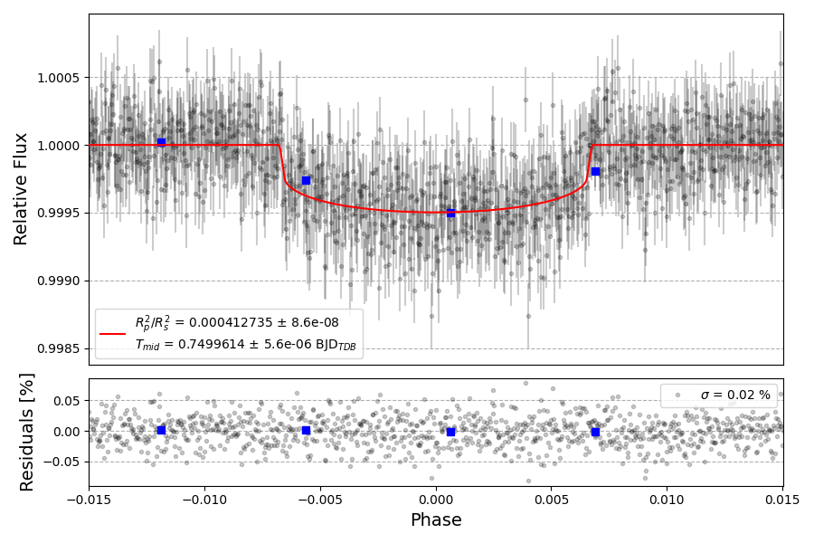
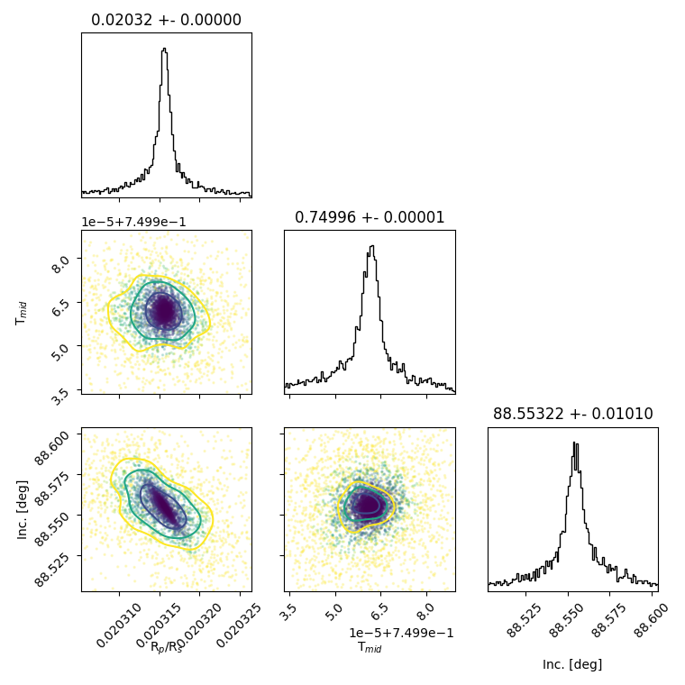
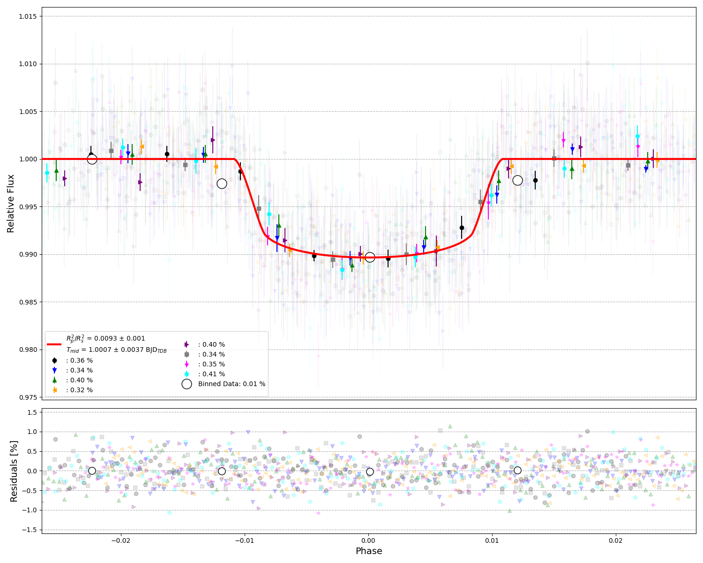
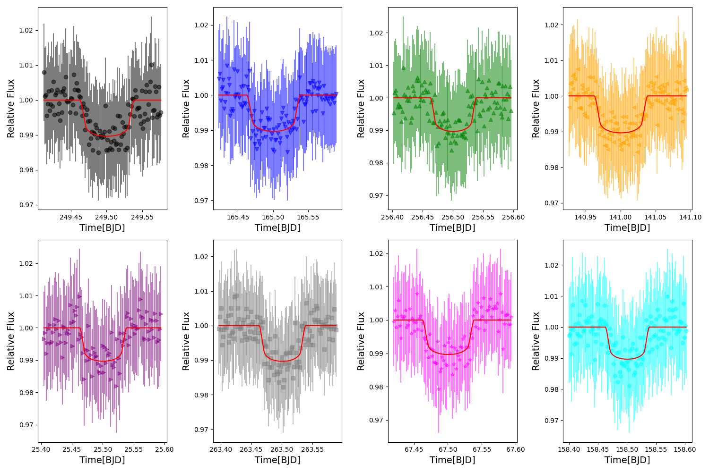
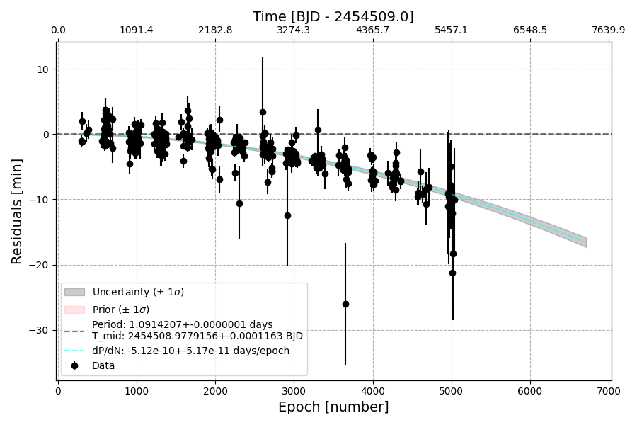
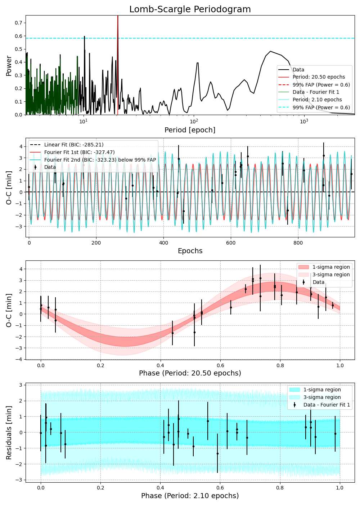

# EXOTIC Use Cases

This repository contains examples of how to use the EXOTIC software to perform a variety of tasks related to exoplanet transit science. The package is designed to be used with FITS images, photometric data, radial velocity data, and ephemeris data. The examples below are organized by the type of data used in the analysis.

## [Fit a transit light curve](single_transit/transit_fit_example.py)

Start from a photometric timeseries and derive transit parameters like planetary radius, inclination and mid-transit time. Optimized in a Bayesian framework ([Ultranest](https://johannesbuchner.github.io/UltraNest/index.html)) with posteriors to assess degeneracies and uncertainties.

## Fit multiple light curves simultaneously with shared and individual parameters

- [Simultaneous airmass detrending](multiple_transit/Multiple_Lightcurve_fit.ipynb) (more robust but takes much longer)

- [Airmass detrending prior to simultaneous fit](multiple_transit/Multiple_Lightcurve_Fit_Detrended.ipynb)

The notebooks above are also compatible with TESS data! Just don't include an `a2` parameter for airmass detrending in the local bounds.

## [TESS light curve generation](tess.py)

## [Ephemeris fitting](ephemeris/fit_ephemeris.py)
- Observed - Calculated plot with colors coded to data source

- [Orbital Decay](ephemeris/fit_decay.py)

- Periodogram for transit timing search with up to two orders

- [N-body interpretation of periodogram](https://github.com/pearsonkyle/Nbody-ai)

## [Radial Velocity](radial_velocity/rv_example.py)

- [Joint Fit of Transit Photometry, Radial Velocity, and Ephemeris data (mid-transit/eclipse times)](joint_rv_transit/joint_fit.py)

## [Programmatic Access to Exoplanet Watch Results](Exoplanet_Watch_API.ipynb) 

Download parameters that are derived from photometric data and light curves for a given target. Over 350 targets and 5000 publicly available light curves from ground-based and space-based telescopes.

## Acknowledgements

If you use any Exoplanet Watch data or in your publication, you are required to include the observers of those data as co-authors on your paper. To get in touch with your anonymous observer, contact the [AAVSO](https://www.aavso.org/) with their observer code.

If you make use of Exoplanet Watch in your work, please cite the papers [Zellem et al. 2020](https://ui.adsabs.harvard.edu/abs/2020PASP..132e4401Z/abstract) and [Pearson et al. 2022](https://ui.adsabs.harvard.edu/abs/2022AJ....164..178P/abstract) and include the following standard acknowledgment in any published material that makes use of Exoplanet Watch data: **“This publication makes use of data products from Exoplanet Watch, a citizen science project managed by NASA's Jet Propulsion Laboratory on behalf of NASA's Universe of Learning. This work is supported by NASA under award number NNX16AC65A to the Space Telescope Science Institute, in partnership with Caltech/IPAC, Center for Astrophysics|Harvard & Smithsonian, and NASA Jet Propulsion Laboratory."**